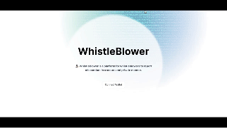

# Whistleblower Platform


## User-Focused Summary:
Whistleblower is a decentralized platform designed to enable whistleblowers to report misconduct securely and privately. Users can submit reports without revealing their identities, fostering transparency and accountability within organizations.

## Investor Pitch:
The platform addresses the critical need for secure whistleblowing mechanisms, particularly in environments where individuals fear retaliation for exposing misconduct. By leveraging blockchain technology and Secret smart contracts, Whistleblower ensures the confidentiality of whistleblowers while facilitating the reporting process. This product-market fit addresses the growing demand for transparency and accountability across various sectors.

## ⚙️ Tech Stack

- [Next.js](https://nextjs.org/) – Framework
- [Typescript](https://www.typescriptlang.org/) – Language
- [Tailwind](https://tailwindcss.com/) – CSS
- [shadcn/ui](https://ui.shadcn.com) - UI Components
- [Aceternity ui](https://ui.aceternity.com/) - UI Components
- [Mongoose](https://mongoosejs.com/) - ORM
- [MongoDB](https://www.mongodb.com/) - Database
- [Vercel](https://vercel.com/) – Hosting

## 👨‍💻 Getting Started

### Prerequisites

Here's what you need to be able to run WhistleBlower:

- Node.js 
- MongoDB Database - connection string

#### First Clone the repository

```shell
git clone https://github.com/Gourav-21/Polygon-WhistleBlower.git

```

### Set up the contract

#### 1. Deploy the smart contract on the Secret Network testnet
go to the node folder WhistleBlower->contract->node 

```shell
cd WhistleBlower/contract/node
```
#### 2. Install npm dependencies

```shell
npm install
```

#### 3. run

```shell
node index.js
```

#### 4. copy the `contract address` and `contract hash` from terminal

### Set up the frontend

#### 1. go to the next-frontend folder

```shell
cd ../../next-frontend/
```
or if you are in the WhistleBlower folder
```
cd next-frontend 
```

#### 2. Install npm dependencies

```shell
npm install
```

#### 3. Copy the environment variables to `.env.local` and change the values

```shell
cp .env.example .env.local
```

The following environment variables must be set:
- `CONTRACT_ADDRESS` - The contract address of the WhistleBlower smart contract

- `CONTRACT_HASH` - The contract hash of the WhistleBlower smart contract

- `MONGODB_URI` - The connection string for the MongoDB database

Replace the contract address and contract hash with the one you copied from the terminal
and create a [MongoDB database](https://www.mongodb.com/) and copy the connection string


#### 4. Run the dev server

```shell
npm run dev
```

#### 5. Open the app in your browser

Visit [http://localhost:3000](http://localhost:3000) in your browser.


## Features

### Usage Guidelines:
- Users can navigate to the platform's frontend to view whistleblower posts anonymously.
- To submit a whistleblower report, users doesnt need to create an account.
- So, users can submit a report providing details of the misconduct without revealing their identity.
- Other users can interact with the posts by liking, commenting, and sharing.
- The platform ensures the privacy and security of whistleblowers by encrypting and storing data using Secret smart contracts.

### Additional Information:
- MongoDB is used to store additional details such as post metadata like likes, and comments.
- The frontend is developed using Next.js, providing a seamless user experience.
- Smart contracts are deployed on the Secret Network for privacy and security.
- The platform encourages collaboration and contributions by being open source.

### Demo Video:
https://www.youtube.com/watch?v=gEg9Jlg3IJ4&feature=youtu.be

[](https://www.youtube.com/watch?v=gEg9Jlg3IJ4)
